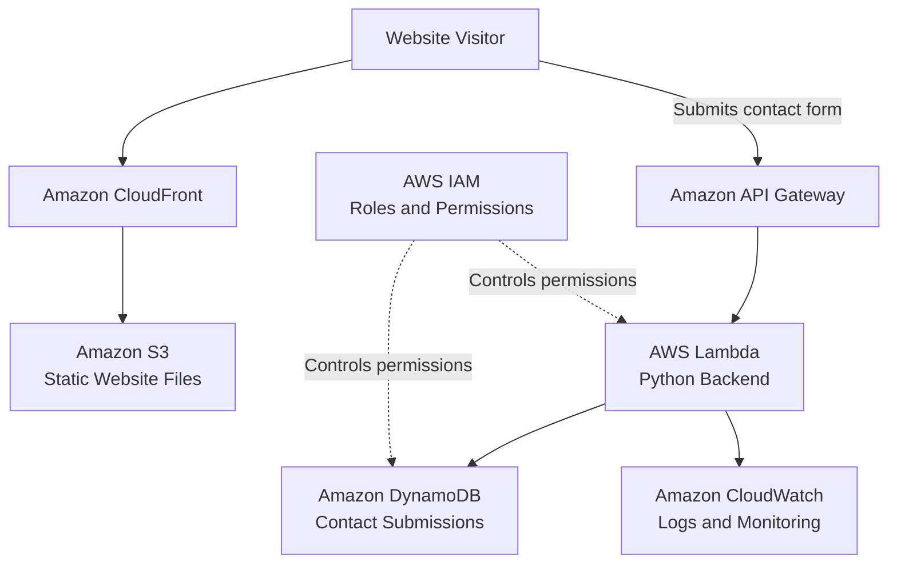

# AWS Serverless Portfolio — Architecture Diagram

## Project Status

Planned architecture for the first version of the AWS Serverless Portfolio.

## Architecture Explanation

1. The visitor opens the portfolio website.
2. Amazon CloudFront delivers the website content.
3. Amazon S3 stores the static HTML, CSS, JavaScript, and image files.
4. The contact form sends a request to Amazon API Gateway.
5. API Gateway invokes an AWS Lambda function.
6. Lambda validates and processes the message.
7. DynamoDB stores the valid submission.
8. CloudWatch records Lambda logs and errors.
9. IAM roles control which AWS resources Lambda can access.

## Security Notes

- CloudFront will deliver the website using HTTPS.
- The S3 bucket should not allow unnecessary public access.
- Lambda should use an IAM role rather than stored access keys.
- IAM permissions should follow least privilege.
- Contact-form input must be validated before storage.

## Current Status

This is a planning diagram. No AWS resources have been deployed yet.
